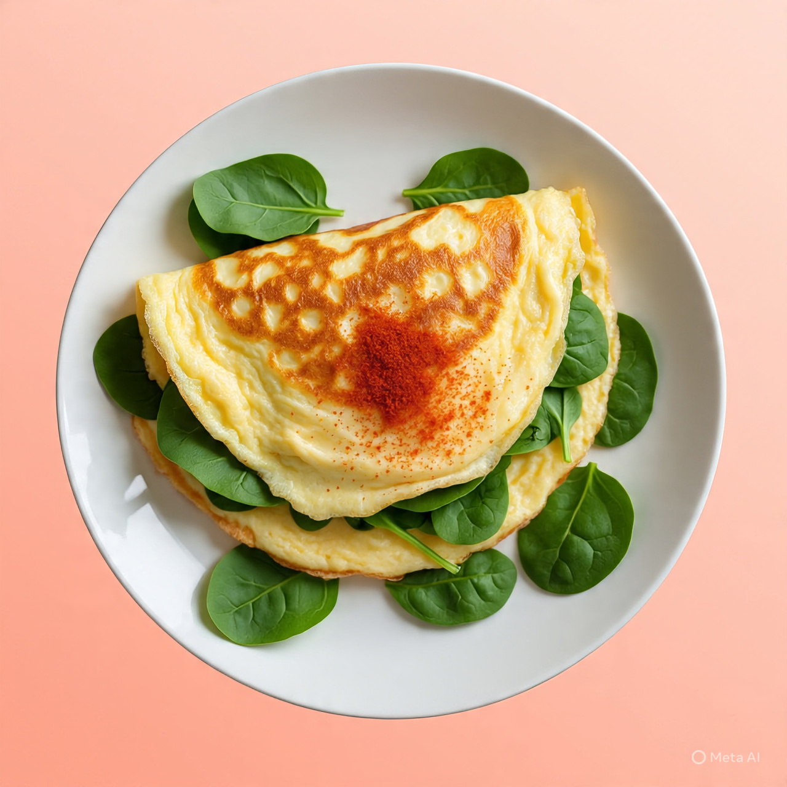

# Responsive Recipe Card

A simple and responsive recipe card built with **HTML** and **CSS**.  
This project showcases a clean UI layout with an image, preparation details, ingredients, instructions, and nutrition table.  

## 🚀 Live Demo
<!DOCTYPE html>
<html lang="en">
<head>
  <meta charset="UTF-8">
  <meta name="viewport" content="width=device-width, initial-scale=1.0">
  <title>Recipe</title>
  <link rel="stylesheet" href="style.css">
</head>
<body>
  <main class="recipe">
    <section class="recipe__card">
      
      

        <h2 class="recipe__title">Simple Omelette Recipe</h2>
        
An easy and quick dish, perfect for any meal. This classic omelette combines beaten eggs cooked to perfection, optionally filled with your choice of cheese, vegetables, or meats.

        

          <h3 class="recipe__preparation-time-title">Preparation time</h3>
          <ul class="recipe__preparation-time-list">
            <li class="recipe__preparation-time-item"><strong>Total:</strong> Approximately 10 minutes</li>
            <li class="recipe__preparation-time-item"><strong>Preparation:</strong> 5 minutes</li>
            <li class="recipe__preparation-time-item"><strong>Cooking:</strong> 5 minutes</li>
          </ul>
        

        <h2 class="recipe__section-title">Ingredients</h2>
        <ul class="recipe__ingredients-list">
          <li class="recipe__ingredients-item">2-3 large eggs</li>
          <li class="recipe__ingredients-item">Salt, to taste</li>
          <li class="recipe__ingredients-item">Pepper, to taste</li>
          <li class="recipe__ingredients-item">1 tablespoon of butter or oil</li>
          <li class="recipe__ingredients-item">Optional fillings: cheese, diced vegetables, cooked meats, herbs.</li>
        </ul>
        <h2 class="recipe__section-title">Instructions</h2>
        <ol class="recipe__instructions-list">
          <li class="recipe__instructions-item"><strong>Beat the eggs:</strong> In a bowl, beat the eggs with a pinch of salt and pepper until they are well mixed. You can add a tablespoon of water or milk for a fluffier texture.</li>
          <li class="recipe__instructions-item"><strong>Heat the pan:</strong> Place a non-stick frying pan over medium heat and add butter or oil.</li>
          <li class="recipe__instructions-item"><strong>Cook the omelette:</strong> Once the butter is melted and bubbling, pour in the eggs. Tilt the pan to ensure the eggs evenly coat the surface.</li>
          <li class="recipe__instructions-item"><strong>Add fillings (optional):</strong> When eggs begin to set at the edges but are still slightly runny in the middle, sprinkle your chosen fillings over one half of the omelette.</li>
          <li class="recipe__instructions-item"><strong>Fold and serve:</strong> As the omelette continues to cook, carefully lift one edge and fold it over the fillings. Let it cook for another minute, then slide it onto a plate.</li>
          <li class="recipe__instructions-item"><strong>Enjoy:</strong> Serve hot, with additional salt and pepper if needed.</li>
        </ol>
        <h2 class="recipe__section-title">Nutrition</h2>
        
The table below shows nutrition values per serving without the additional fillings.

        <table class="recipe__nutrition-table">
          <tr class="recipe__nutrition-row">
            <th class="recipe__nutrition-header">Calories</th>
            <td class="recipe__nutrition-value">277kcal</td>
          </tr>
          <tr class="recipe__nutrition-row">
            <th class="recipe__nutrition-header">Carbs</th>
            <td class="recipe__nutrition-value">0g</td>
          </tr>
          <tr class="recipe__nutrition-row">
            <th class="recipe__nutrition-header">Protein</th>
            <td class="recipe__nutrition-value">20g</td>
          </tr>
          <tr class="recipe__nutrition-row">
            <th class="recipe__nutrition-header">Fat</th>
            <td class="recipe__nutrition-value">22g</td>
          </tr>
        </table>
      

    </section>
  </main>
</body>
</html>

## 📌 Features
- Fully responsive design (mobile, tablet, desktop)
- Card-style layout with image and content
- Styled preparation time section
- Ingredients and step-by-step instructions
- Nutrition facts table
.recipe {
  max-width: 800px;
  margin: 40px auto;
  padding: 20px;
  background-color: #fff;
  border: 1px solid #ddd;
  border-radius: 10px;
  box-shadow: 0 0 10px rgba(0, 0, 0, 0.1);
}

.recipe__card {
  padding: 20px;
}

.recipe__image {
  width: 100%;
  height: 200px;
  object-fit: cover;
  border-radius: 10px 10px 0 0;
}

.recipe__content {
  padding: 20px;
}

.recipe__title {
  font-size: 24px;
  font-weight: bold;
  margin-bottom: 10px;
}

.recipe__description {
  font-size: 16px;
  color: #666;
  margin-bottom: 20px;
}

.recipe__preparation-time {
  margin-bottom: 20px;
}

.recipe__preparation-time-title {
  font-size: 18px;
  font-weight: bold;
  margin-bottom: 10px;
}

.recipe__preparation-time-list {
 2rem;
  list-style: none;
  padding: 0;
  margin: 0;
}

.recipe__preparation-time-item {
  font-size: 16px;
  color: #666;
  margin-bottom: 10px;
}

.recipe__section-title {
  font-size: 20px;
  font-weight: bold;
  margin-bottom: 10px;
}

.recipe__ingredients-list {
  list-style: none;
  padding: 0;
  margin: 0;
}

.recipe__ingredients-item {
  font-size: 16px;
  color: #666;
  margin-bottom: 10px;
}

.recipe__instructions-list {
  list-style: decimal;
  padding: 0;
  margin: 0;
}

.recipe__instructions-item {
  font-size: 16px;
  color: #666;
  margin-bottom: 10px;
}

.recipe__nutrition-table {
  border-collapse: collapse;
  width: 100%;
}

.recipe__nutrition-row {
  border-bottom: 1px solid #ddd;
}

.recipe__nutrition-header {
  font-size: 16px;
  font-weight: bold;
  padding: 10px;
  text-align: left;
}

.recipe__nutrition-value {
  font-size: 16px;
  padding: 10px;
  text-align: right;
}

## 🛠️ Built With
- HTML  
- CSS3 (Flexbox)  

# 🙋Thanks for checking it OUT! 

